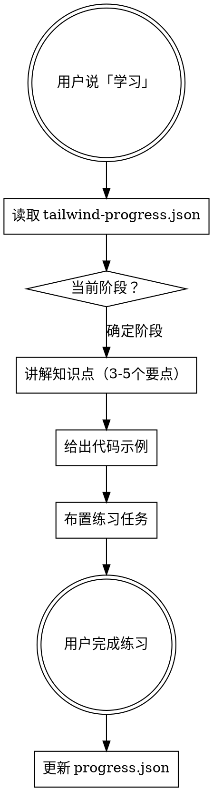

# Tailwind CSS 学习教程

## Overview

本项目成员的 TailwindCSS v4 学习计划。每次用户要求学习时，根据当前进度提供对应阶段教程，完成后更新进度。

## 进度追踪

进度文件：`src/tailwind-progress.json`

每次开始学习时读取该文件确定当前阶段。每次完成学习后更新该文件。

## 学习阶段

### 阶段一：基础概念（1-2天）

**目标：理解 Tailwind 的核心理念**

1. **Utility-First 思维** — 每个 CSS 属性对应一个 class
   - `p-4` = `padding: 1rem`
   - `text-red-500` = `color: red`
   - `flex` = `display: flex`

2. **间距与尺寸系统** — 基于 4px 网格的数字比例
   - `p-2` = 8px, `p-4` = 16px, `p-8` = 32px
   - `m-1` ~ `m-96`, `w-1/2`, `h-screen`
   - 负值：`-mt-4`

3. **颜色系统** — `{property}-{color}-{shade}`
   - `bg-blue-500`, `text-gray-100`, `border-red-300`
   - 100（最浅）→ 900（最深），500 为基准色

**练习：** 用纯 Tailwind 在 `src/components/TailwindLab.tsx` 中复现一个简单的名片卡片布局

---

### 阶段二：布局核心（2-3天）

**目标：掌握 Flexbox 和 Grid 的 Tailwind 用法**

4. **Flexbox 布局**
   ```
   flex flex-col flex-row justify-center items-center gap-4
   flex-1 flex-wrap
   ```

5. **Grid 布局**
   ```
   grid grid-cols-3 grid-rows-2 gap-6
   col-span-2 row-start-1
   ```

6. **响应式设计** — 移动优先，断点递增
   - `sm:` (640px), `md:` (768px), `lg:` (1024px), `xl:` (1280px)
   - `grid-cols-1 md:grid-cols-2 lg:grid-cols-3`
   - `hidden md:block`

**练习：** 创建一个响应式导航栏 + 卡片网格页面

---

### 阶段三：排版与视觉（2-3天）

**目标：掌握文本、边框、阴影等样式**

7. **排版**
   - `text-xl font-bold tracking-wide leading-relaxed`
   - `text-center uppercase truncate`

8. **边框与圆角**
   - `border border-gray-200 rounded-lg rounded-full`
   - `divide-y divide-gray-100`

9. **阴影与透明度**（v4 尺寸变化，见下方说明）
   - `shadow-xs shadow-sm shadow-md shadow-lg`
   - `opacity-75 ring-2 ring-blue-500`

10. **背景**
    - `bg-linear-to-r from-blue-500 to-purple-600`（v4 重命名）
    - `bg-cover bg-center bg-no-repeat`

**练习：** 创建一个定价卡片组件，包含渐变、阴影、边框

---

### 阶段四：交互与状态（2-3天）

**目标：理解状态变体和过渡动画**

11. **状态前缀**
    - `hover:bg-blue-600` `focus:ring-2` `active:scale-95`
    - `disabled:opacity-50` `group-hover:opacity-100`

12. **Group 和 Peer**
    ```jsx
    <div className="group">
      
      <p className="group-hover:text-blue-500">标题</p>
    </div>
    ```

13. **过渡与动画**
    - `transition duration-300 ease-in-out`
    - `animate-spin animate-bounce animate-pulse`

14. **Dark Mode**（v4 CSS-first 配置）
    - `dark:bg-gray-900 dark:text-white`
    - 默认跟随系统 `prefers-color-scheme`
    - 手动切换需在 CSS 中配置 `@custom-variant`

**练习：** 创建一个带 hover 效果的图片卡片画廊 + dark mode 切换

---

### 阶段五：实战组件（3-5天）

**目标：综合运用，构建常见 UI 组件**

15. **组件练习清单**（在 `src/components/` 下创建）：
    - Modal 对话框（overlay + 居中 + 动画）
    - Dropdown 下拉菜单（定位 + hover/click）
    - Toast 通知（固定定位 + 进入/退出动画）
    - 表单（输入框校验样式 + focus 状态）
    - 数据表格（斑马纹 + 排序图标 + 响应式）

16. **结合 classNames 工具**
    ```tsx
    // src/utils/index.ts 中已有的条件类名工具
    <div className={classNames('p-4 rounded', { 'bg-red-100': isError })} />
    ```

---

### 阶段六：进阶技巧（2-3天）

17. **自定义配置** — CSS-first `@theme` 指令（v4 新方式）
    - 在 `app.css` 中用 `@theme { }` 定义自定义颜色、间距、字体
    - 不再需要 `tailwind.config.js`

18. **@apply 指令** — 提取重复样式
    ```css
    .btn-primary {
      @apply px-4 py-2 bg-blue-500 text-white rounded hover:bg-blue-600;
    }
    ```

19. **性能优化**
    - v4 自动检测内容文件，无需 `content` 配置
    - 自动移除未使用的样式
    - 类名顺序：配合 ESLint 规则

---

## Tailwind v3 → v4 迁移要点

教程中已标注 v4 变更，以下是完整对照表，教学时需注意：

### 重命名的工具类

| v3 | v4 | 说明 |
|----|----|------|
| `bg-gradient-to-r` | `bg-linear-to-r` | 线性渐变方向 |
| `shadow-sm` | `shadow-xs` | 最小阴影 |
| `shadow`（裸值） | `shadow-sm` | 默认阴影 |
| `rounded-sm` | `rounded-xs` | 最小圆角 |
| `rounded`（裸值） | `rounded-sm` | 默认圆角 |
| `blur-sm` | `blur-xs` | 最小模糊 |
| `blur`（裸值） | `blur-sm` | 默认模糊 |
| `ring`（裸值） | `ring-3` | 默认 ring 宽度从 3px 变为 1px |
| `outline-sm` | `outline-xs` | 最小轮廓 |
| `outline`（裸值） | `outline-sm` | 默认轮廓 |

### 配置方式变化

| v3 | v4 |
|----|-----|
| `tailwind.config.js` | CSS `@theme { }` 指令 |
| `darkMode: 'class'` | `@custom-variant dark (&:where(.dark, .dark *))` |
| `content: [...]` | 自动检测，无需配置 |
| PostCSS 插件 | `@tailwindcss/vite` 或 `@tailwindcss/postcss` |
| `@tailwind base/components/utilities` | `@import 'tailwindcss'` 一行搞定 |

### 渐变相关

- `bg-gradient-to-*` → `bg-linear-to-*`
- `from-*` / `via-*` / `to-*` 不变
- 渐变值在使用变体（如 `dark:`）时会被保留而非重置
- 用 `via-none` 可以显式清除三色渐变的中间色

---

## 教学流程



**每次教学：**
1. 读取 `src/tailwind-progress.json` 确定当前进度
2. 讲解当前阶段的 3-5 个核心要点，配合代码示例
3. 布置一个小练习，用户在组件文件中实现
4. 用户完成后，审查代码并给出反馈
5. 更新 `src/tailwind-progress.json` 进度

## 进度文件格式

```json
{
  "currentStage": 1,
  "stages": [
    { "id": 1, "name": "基础概念", "status": "in_progress", "completedTopics": [], "notes": "" },
    { "id": 2, "name": "布局核心", "status": "locked" },
    { "id": 3, "name": "排版与视觉", "status": "locked" },
    { "id": 4, "name": "交互与状态", "status": "locked" },
    { "id": 5, "name": "实战组件", "status": "locked" },
    { "id": 6, "name": "进阶技巧", "status": "locked" }
  ]
}
```

**状态值：** `locked` → `in_progress` → `completed`

## 参考资源

- [Tailwind v4 官方文档](https://tailwindcss.com/docs) — 按功能分类的权威参考
- [v3 → v4 升级指南](https://tailwindcss.com/docs/upgrade-guide) — 迁移对照表
- [Tailwind Cheat Sheet](https://nerdcave.com/tailwind-cheat-sheet) — 快速查找类名
- [Tailwind UI Components](https://tailwindui.com/components) — 官方组件示例
- [Headless UI](https://headlessui.com/) — 无样式可访问组件
