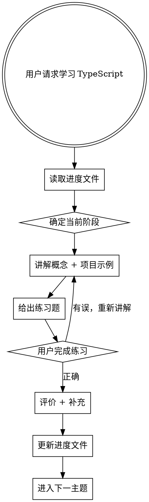

# TypeScript 学习 Skill

## 概述

为 React + TypeScript 项目开发者提供循序渐进的 TypeScript 学习路径。每个阶段包含概念讲解、项目中的真实代码示例、和练习题。

## 进度追踪

- 进度文件：`src/typescript-progress.json`
- 每次完成一个阶段或主题后，**立即更新**进度文件
- 进度状态：`locked` → `in_progress` → `completed`

## 学习路线（8 个阶段）

---

### 阶段 1：基础类型

**目标：** 掌握 TypeScript 的基本类型系统

**主题：**

1. **类型注解 vs 类型推断**
   - 类型注解：`let name: string = '张三'`
   - 类型推断：`let name = '张三'` → TS 自动推断为 `string`
   - 规则：能推断就不写，需要明确时才注解

2. **原始类型**
   - `string`、`number`、`boolean`
   - `null`、`undefined`

3. **特殊类型**
   - `void` — 函数正常结束但没有返回值
   - `never` — 函数永远不会正常结束（抛异常、死循环）
   - `any` — 逃出类型检查，尽量少用
   - `unknown` — 安全版的 `any`，使用前必须收窄

4. **数组与元组**
   - 数组：`number[]` 或 `Array<number>`
   - 元组：`[string, number]` — 固定长度和类型

5. **枚举**
   - 数字枚举、字符串枚举
   - `enum` vs 联合字面量类型的取舍

**练习：** 为变量、函数参数和返回值添加类型注解

---

### 阶段 2：接口与类型别名

**目标：** 学会用 interface 和 type 描述对象形状

**主题：**

1. **interface 基础**
   ```typescript
   interface User {
     name: string
     age: number
     email?: string  // 可选属性
     readonly id: number  // 只读属性
   }
   ```

2. **type 类型别名**
   ```typescript
   type Point = { x: number; y: number }
   type ID = string | number
   type Callback = (data: Response) => void
   ```

3. **interface vs type 的区别**
   - interface 可以声明合并（declaration merging）
   - type 支持联合类型、交叉类型、条件类型
   - 选择原则：对象形状用 interface，其他用 type

4. **索引签名**
   ```typescript
   interface Dictionary {
     [key: string]: string
   }
   ```

5. **嵌套与组合**
   ```typescript
   interface Address {
     city: string
     street: string
   }
   interface User {
     name: string
     address: Address  // 嵌套
   }
   ```

**练习：** 为项目中的组件 Props 定义 interface 和 type

---

### 阶段 3：联合与交叉类型

**目标：** 掌握类型组合的核心技巧

**主题：**

1. **联合类型 (Union)**
   ```typescript
   type Status = 'active' | 'inactive' | 'pending'
   type ID = string | number
   ```

2. **字面量类型**
   ```typescript
   type Direction = 'left' | 'right' | 'up' | 'down'
   const method = 'GET' as const  // 字面量类型而非 string
   ```

3. **交叉类型 (Intersection)**
   ```typescript
   type Employee = Person & { employeeId: string }
   ```

4. **as const 断言**
   ```typescript
   const colors = ['red', 'green', 'blue'] as const
   // 类型变为 readonly ['red', 'green', 'blue'] 而非 string[]
   ```

5. **类型收窄初步**
   - `typeof` 收窄：`if (typeof x === 'string')`
   - 真值收窄：`if (value)`
   - 相等收窄：`if (x !== null)`

**练习：** 使用联合类型描述组件的 variant、size 等 props

---

### 阶段 4：函数类型

**目标：** 精通 TypeScript 中的函数类型定义

**主题：**

1. **函数类型表达式**
   ```typescript
   type Greet = (name: string) => string
   const greet: Greet = (name) => `Hello, ${name}`
   ```

2. **可选参数与默认值**
   ```typescript
   function createUser(name: string, role: string = 'user', active?: boolean) {}
   ```

3. **剩余参数**
   ```typescript
   function sum(...numbers: number[]): number {}
   ```

4. **函数重载**
   ```typescript
   function format(value: string): string
   function format(value: number): string
   function format(value: string | number): string {
     return typeof value === 'number' ? value.toFixed(2) : value.trim()
   }
   ```

5. **回调函数类型**
   ```typescript
   function fetchData(url: string, onSuccess: (data: unknown) => void, onError: (err: Error) => void): void {}
   ```

**练习：** 为项目中使用的工具函数添加完整类型定义

---

### 阶段 5：泛型

**目标：** 理解并使用泛型编写可复用的类型安全代码

**主题：**

1. **泛型基础**
   ```typescript
   function identity<T>(value: T): T { return value }
   identity<string>('hello')  // 显式指定
   identity(42)               // 自动推断
   ```

2. **泛型约束 (extends)**
   ```typescript
   function getLength<T extends { length: number }>(item: T): number {
     return item.length
   }
   ```

3. **多个泛型参数**
   ```typescript
   function map<T, U>(arr: T[], fn: (item: T) => U): U[] {}
   ```

4. **泛型接口与类型别名**
   ```typescript
   interface ApiResponse<T> {
     data: T
     status: number
     message: string
   }
   type Pair<A, B> = [A, B]
   ```

5. **keyof 操作符**
   ```typescript
   function getProperty<T, K extends keyof T>(obj: T, key: K): T[K] {}
   ```

**练习：** 编写一个泛型的 useLocalStorage hook

---

### 阶段 6：类型守卫与收窄

**目标：** 熟练使用各种类型守卫实现安全的类型收窄

**主题：**

1. **typeof 收窄**
   ```typescript
   function process(value: string | number) {
     if (typeof value === 'string') {
       // value: string
     }
   }
   ```

2. **instanceof 收窄**
   ```typescript
   if (error instanceof TypeError) { /* ... */ }
   ```

3. **in 操作符收窄**
   ```typescript
   if ('email' in user) { /* user 有 email 属性 */ }
   ```

4. **判别联合 (Discriminated Union)**
   ```typescript
   type Shape =
     | { kind: 'circle'; radius: number }
     | { kind: 'square'; size: number }

   function area(shape: Shape) {
     switch (shape.kind) {
       case 'circle': return Math.PI * shape.radius ** 2
       case 'square': return shape.size ** 2
     }
   }
   ```

5. **自定义类型守卫 (type predicate)**
   ```typescript
   function isString(value: unknown): value is string {
     return typeof value === 'string'
   }
   ```

6. **satisfies 操作符**
   ```typescript
   const config = {
     port: 3000,
     host: 'localhost',
   } satisfies Record<string, string | number>
   ```

**练习：** 用判别联合实现一个状态机（如请求状态 idle/loading/success/error）

---

### 阶段 7：类型操控

**目标：** 掌握 TypeScript 内置工具类型和高级类型操作

**主题：**

1. **常用工具类型**
   - `Partial<T>` — 所有属性变可选
   - `Required<T>` — 所有属性变必填
   - `Readonly<T>` — 所有属性变只读
   - `Pick<T, K>` — 选取部分属性
   - `Omit<T, K>` — 排除部分属性
   - `Record<K, V>` — 构造键值对类型
   - `Exclude<T, U>` / `Extract<T, U>`
   - `NonNullable<T>`
   - `ReturnType<T>` / `Parameters<T>`
   - `Awaited<T>` — 解包 Promise

2. **条件类型**
   ```typescript
   type IsString<T> = T extends string ? true : false
   ```

3. **映射类型**
   ```typescript
   type Optional<T> = {
     [K in keyof T]?: T[K]
   }
   ```

4. **模板字面量类型**
   ```typescript
   type EventName = `on${Capitalize<string>}`
   type CSSProperty = `margin-${'top' | 'right' | 'bottom' | 'left'}`
   ```

**练习：** 为项目中的表单组件编写类型安全的验证系统

---

### 阶段 8：TypeScript + React

**目标：** 在 React 项目中熟练使用 TypeScript

**主题：**

1. **组件 Props 类型**
   ```typescript
   interface ButtonProps {
     variant: 'primary' | 'secondary'
     size?: 'sm' | 'md' | 'lg'
     children: React.ReactNode
     onClick: () => void
   }
   ```

2. **事件处理**
   ```typescript
   function handleChange(e: React.ChangeEvent<HTMLInputElement>) {}
   function handleClick(e: React.MouseEvent<HTMLButtonElement>) {}
   function handleSubmit(e: React.FormEvent<HTMLFormElement>) {}
   ```

3. **React Hooks 类型**
   - `useState<Type>()` — 泛型 state
   - `useRef<Type>(null)` — ref 类型
   - `useEffect` — 无需特殊类型
   - `useContext` — Context 类型定义
   - `useCallback` / `useMemo` — 自动推断

4. **Ref 类型**
   ```typescript
   const inputRef = useRef<HTMLInputElement>(null)
   const divRef = useRef<HTMLDivElement>(null)
   ```

5. **forwardRef 与泛型组件**
   ```typescript
   const Input = forwardRef<HTMLInputElement, InputProps>(
     (props, ref) => <input ref={ref} {...props} />
   )
   ```

6. **children 与 ReactNode**
   - `React.ReactNode` vs `JSX.Element` vs `React.ReactElement`

**练习：** 为项目中的现有组件补充完整的 TypeScript 类型定义

---

## 教学流程



## 进度文件格式

文件路径：`src/typescript-progress.json`

```json
{
  "currentStage": 1,
  "stages": [
    {
      "id": 1,
      "name": "基础类型",
      "status": "in_progress",
      "completedTopics": ["类型注解与推断", "原始类型", "特殊类型", "数组与元组", "枚举"],
      "notes": "用户笔记"
    }
  ]
}
```

状态值：`"locked"` | `"in_progress"` | `"completed"`

## 教学原则

1. **从项目代码出发** — 用用户项目中真实的代码举例
2. **先练后讲** — 先给出练习，根据回答补充知识点
3. **渐进式** — 每次只推进一个主题，确认理解后再继续
4. **对比教学** — 每个新概念都和 JavaScript 做对比
5. **即时反馈** — 每次练习后立刻评价并更新进度
